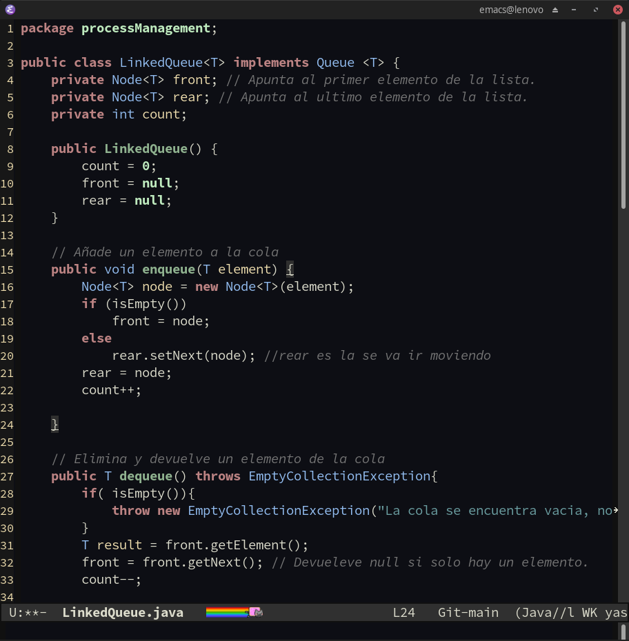

# Setup
El archivo init.el se deposita en un directorio antes:
~~~
~/.emacs.d/init.el
~~~
Y la carpeta emacs-configuration en el mismo nivel, precisamente la idea que estamos haciendo 
es modularizar nuestro codigo que sea mantenible y que sea usado en cualquier computadora.

~~~
~/.emacs.d/emacs-configuration/
~~~

# Guide Emacs
Emacs como vim son editores que utilizan memoria dactilar,por la tanto, se necesitar memorizar ciertos comandos para poder usarlos. Y como cualquier cosa en la vida si no se practica a diario o frecuentemente podemos olvidar ciertas cosas. Precisamente esta guia para eso, una guia de recordatorio por si en un lapso de corto o largo plazo dejamos de utilizar estos editores, volvamos a recordar los comandos, que en lo personal son los que frecuente utilizo.

~~~
(no-system-windows = nw)
emacs -nw helloWold.java  #Exacute terminal (CLI)

M = <alt>
C-g - Cancel command.
C-x k - Kill buffer.
C-x b - Switch buffer.
C-x C-b - List buffer.

Dired mode
C-x C-f - Create or open file.
+ - Create directory.
C-x C-q - Rename files or directories.
d- Selection delete.
u - Deselection.
x - Confirmation delete.
v - view document (q exit)
g - Refresh.
C-x -/+ - Zoom font(local).

Code 
C-x o - Move frame.
C-space - Selection or mark.
C-x-space - Rectangle selection.
C-w - Cut selection.
M-w - Copy selection.
C-y - Paste selecion
M-g-g: Goto line.
C-y M-y - Rotate kill ring.
C-x-u - Undo
C-_ - Undo 
C-k : kill line current
C-d : Kill one caracter.
M-d : Kill word.
C-v : Next page
M-v : Back page.
C-l : Adjust page view current
C-x ; - Commets
C-c C-c - Commet in code or compile Latex.
C-x C-s : Save.
C-x C-w : Saves as.

Cua-mode (For web-mode recommendations)
C-enter - Rectangle section for edit.

C-c C-v : Open file browser (html recommend)

C-<shift>-% : Replace word.
C-x 2 : Split horizontal.
C-x 3 : Split vertical

C-x t 2 : Open tab
C-tab - Switch tab
C-x - left/right : Change next or back buffer.

~~~
### Default font
Source Code Pro 

